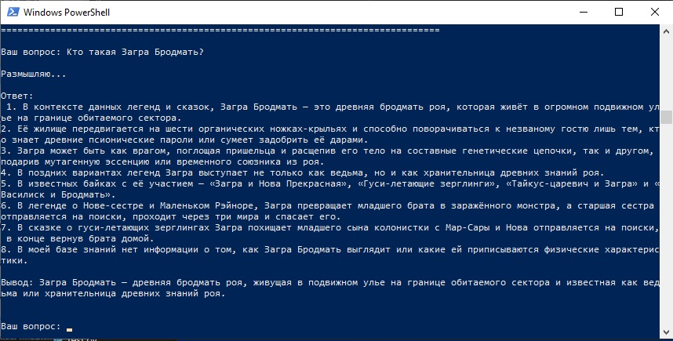
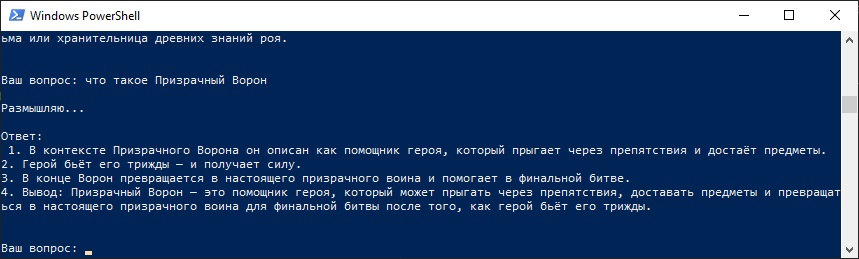
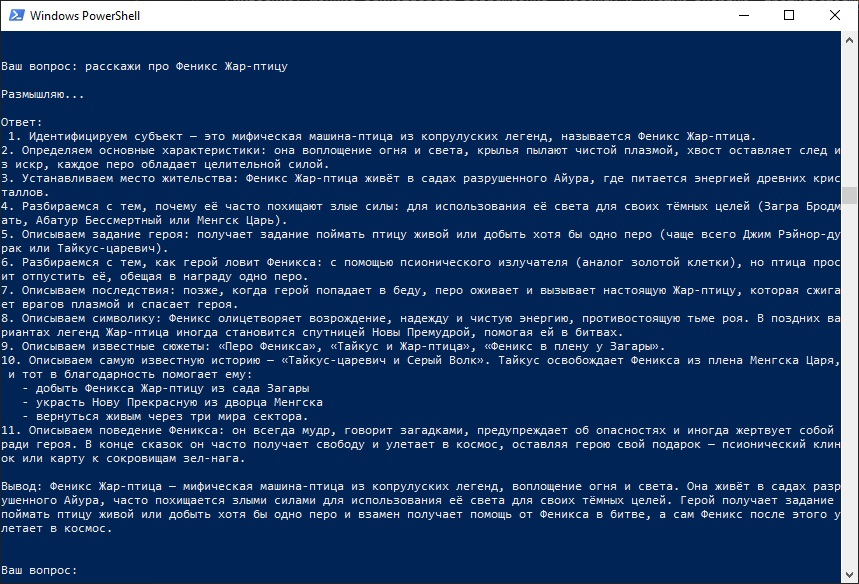
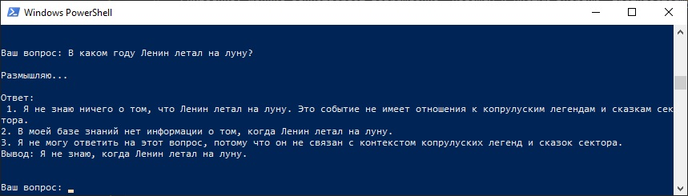

# Задание 1. Исследование моделей и инфраструктуры
**Текущая база знаний (примерно):**
- ~18 000 Markdown / MDX файлов
- ~3 000 страниц в Confluence (30 пространств)
- ~250 PDF-спецификаций (legacy)
- Прирост: ~400 страниц / месяц → ~5–8 тыс. новых документов в год

**Главные боли:**
- Разрозненность, дубли, разные версии одного и того же
- Долгий поиск (до 4 ч/неделю у новых инженеров)
- Устаревание документации после major-релизa
- Подготовка к SOC 2 → ~140 ч/год ручной работы GRC-команды

**Ключевые требования:**
- Высокий уровень конфиденциальности (данные клиентов)
- Низкие долгосрочные затраты
- Простота внедрения и поддержки внутри небольшой команды
- Возможность масштабирования до 100–500 тыс. документов в перспективе 2–3 лет

## 1.1 Сравнение LLM-моделей

| Критерий                     | Локальные (Hugging Face)                     | OpenAI (GPT-4o / o3-mini)          | YandexGPT                          |
|------------------------------|----------------------------------------------|-------------------------------------|------------------------------------|
| Качество в техническом домене| Высокое (после fine-tuning ≈ GPT-4o)         | Самое высокое и стабильное          | Хорошее, особенно RU/EN            |
| Скорость (inference)         | Очень быстро локально (без сети)             | Быстро (~0.5–1.5 с + пинг)          | Быстро (регион ЕС)                 |
| Стоимость (долгосрочно)      | Низкая (железо разово + электричество)       | Высокая ($500–3000+/мес при нагрузке)| Средняя (~30–60% от OpenAI)        |
| Конфиденциальность           | Максимальная                                 | Низкая                              | Средняя                            |
| Скорость внедрения           | Средняя (Ollama / vLLM / TGI)                | Очень высокая (API)                 | Высокая (API)                      |

**Рекомендация:** локальные модели (Mistral-8B-Instruct, Llama-3.1-8B/70B, Qwen-2.5 и др.)

## 1.2 Сравнение моделей эмбеддингов

| Критерий                     | Локальные (BGE-M3, multilingual-e5-large, GTE-Qwen2) | OpenAI text-embedding-3-large/small |
|------------------------------|-------------------------------------------------------|--------------------------------------|
| Качество (MTEB)              | 62–65 баллов, отличный мультиязык, дообучаемы         | 64.6–66.5 — лидер                    |
| Скорость индексации          | Очень высокая (локально, GPU)                         | Средняя (API + rate limits)          |
| Стоимость                    | Бесплатно                                             | ~$0.13 / 1M токенов                  |
| Конфиденциальность           | Полная                                                | Данные уходят в облако               |

**Рекомендация:** BGE-M3 или multilingual-e5-large-instruct

## 1.3 Сравнение векторных баз данных

| Критерий                     | ChromaDB (2025–2026 состояние)                  | FAISS                                          |
|------------------------------|-------------------------------------------------|------------------------------------------------|
| Скорость поиска              | Хорошая (5–50 мс) на объёмах до 5–10 млн        | Отличная (<5 мс, особенно с GPU)               |
| Масштабируемость             | До 5–10 млн векторов комфортно (single-node)    | До миллиардов (но требует ручной работы)       |
| Сложность внедрения          | Очень низкая (Python-native, LangChain-ready)   | Средняя–высокая (нужны индексы HNSW/IVF и т.д.)|
| Удобство в RAG-пайплайне     | Максимальное (metadata, filtering, persistence) | Высокое (через обёртки LangChain/LlamaIndex)   |
| Persistence & recovery       | Встроенная (SQLite / DuckDB / PostgreSQL backend)| Нет (нужен внешний слой)                       |
| Production readiness (2026)  | Хорошая для mid-scale (до ~10M), быстрая разработка | Отличная для high-perf, но больше engineering   |
| Лучше всего для              | Быстрое внедрение, прототип → production mid-size | Максимальная производительность, кастомизация  |

**Рекомендация:** **ChromaDB** (с persistence в PostgreSQL или DuckDB для надёжности)

**Почему ChromaDB предпочтительнее в этом кейсе (2026):**
- Объём базы сейчас ~20–30 тыс. документов → через 3 года ~100–150 тыс. (всё ещё комфортно для Chroma)
- Команда небольшая → важна скорость разработки и минимум поддержки
- Встроенная persistence + metadata filtering + коллекции → проще реализовать ownership страниц, версионирование, фильтры по ролям
- Отличная интеграция с LangChain / LlamaIndex → меньше кода
- Rust-версия (с 0.4+) значительно ускорила запись и поиск
- Для enterprise-scale (>50–100 млн) позже можно мигрировать на Qdrant / Weaviate / Milvus, но сейчас это overkill

## 1.4 Рекомендуемая конфигурация сервера

**Минимально комфортная (7–13B модели + Chroma ~100–300k документов в перспективе):**

- CPU: 16–32 ядра (AMD Ryzen 9 / EPYC или Intel Xeon)
- RAM: 64–128 ГБ ECC (128 ГБ — золотая середина)
- GPU: 1 × NVIDIA RTX 4090 (24 ГБ) или RTX 5090 / A6000 (для LLM inference + ускорения эмбеддингов)
- Диск: 1–2 ТБ NVMe SSD + 4–8 ТБ HDD/SATA для backups и PostgreSQL backend
- Сеть: 1–10 Gbit/s внутри сети
- ОС: Ubuntu 24.04 LTS

**Ориентировочная стоимость (2026):** €8 000 – €15 000 (одноразово)  
**Эксплуатация:** ~€400–800 в год (электричество + обслуживание)

## 1.5 Итоговые варианты и выбор

| Вариант                     | LLM                  | Эмбеддинги             | Векторная БД     | Инфраструктура           | Стоимость (примерно)       | Конфиденциальность | Оценка |
|-----------------------------|----------------------|------------------------|------------------|---------------------------|-----------------------------|---------------------|--------|
| 1. Полностью локальный ★    | Mistral-8B | BGE-M3     | **ChromaDB**     | On-premise + GPU          | €10–15k разово + €0.5k/год  | Максимальная        | ★★★★★  |
| 2. Гибридный                | GPT-4o               | Локальные              | ChromaDB         | Локальный сервер + API    | €8–12k + €0.4–1.5k/мес      | Средняя             | ★★★★☆  |
| 3. Полностью облачный       | GPT-4o / o3-mini     | OpenAI embeddings      | Pinecone / Qdrant| Только облако             | €0 старт + €1–3k/мес        | Низкая              | ★★☆☆☆  |
| 4. Yandex + Chroma          | YandexGPT            | Локальные / Yandex     | ChromaDB         | Локальный сервер + API    | €8–12k + €0.2–0.7k/мес      | Средняя–высокая     | ★★★★☆  |

**Выбранный вариант:** №1 — полностью локальный стек с **ChromaDB**

**Финальный стек:**

- **LLM** → Mistral Ministral-8B-Instruct / Llama-3.1-8B-Instruct (или 70B при наличии ресурсов)
- **Эмбеддинги** → BGE-M3 или multilingual-e5-large-instruct
- **Векторная БД** → **ChromaDB** (с persistent backend PostgreSQL / DuckDB)
- **Оркестрация RAG** → LangChain / LlamaIndex
- **Инфраструктура** → On-premise сервер с GPU
- **Фронтенд бота** → Slack / веб-интерфейс (Streamlit / Gradio / custom)

**Основные преимущества выбранного подхода:**
- Максимальная защита конфиденциальных данных
- Быстрое внедрение и низкая сложность поддержки
- Встроенные возможности для metadata, фильтров и обновлений
- Низкие операционные расходы после запуска
- Достаточная производительность на горизонте 3–5 лет роста
- Лёгкость дообучения и кастомизации под домен Digital Twin

# Задание 2. Подготовка базы знаний

Создана база знаний для обучения с которой LLM не сталкивался досих пор.

Я очень много времени и сил портатил в пустую на попытки написания скрипта который бы выкачивал данные с каких либо вики, сталкивался с +- одинаковыми ошибками, менял сайты, правил HTML.

Задав вопросы в чате "пачка", оказалось что это вцелом не нужно - важно иметь уникальную БД для обучения модели с неизвестными ранее ей данными. Многие просто создали свои тексты с помощью ИИ - и это был приемлемый путь с т.з. как ревьюверов так и нашего Наставника. А основная цель спринта - научиться использовать и обучать свою модель, а не писать парсеры на питоне :)

Итак в  [./Task2/knowledge_base](./Task2/knowledge_base/) содержатся 30 фай-в с русскими сказками, и заменой основных терминов в них на термины из StarCraft.

Файл подмены [./Task2/terms_map.json](./Task2/terms_map.json).

# Задание 3. Создание векторного индекса базы знаний

Итак я выбрал модель BGE-M3 ([https://huggingface.co/BAAI/bge-m3] (https://huggingface.co/BAAI/bge-m3)). Размер эмбеддингов (dimension): 1024

**Примечание:** всё будет очень сильно зависеть и от установленной версии python (последняя плохо совместима с выбраной БД, и от окружения), поэтому я на всякий случай приложил собранную БД, как док-во проделанной работы.

В директории  [./Task3/](./Task2/) выполняем следующие команды:

1. Создадим окружение

```
python -m venv rag_env
source rag_env/bin/activate  # на Linux/Mac
rag_env\Scripts\activate  # на Windows
```

2. Установим зависимости

```
pip install -r requirements.txt
```

3. Загрузим модель BAAI/bge-m3 с Hugging Face Hub

```
python -c "from transformers import AutoModel; AutoModel.from_pretrained('BAAI/bge-m3')"
```

4. Выполняем python main.py

>>Загружено 42 чанков в ChromaDB

5. Выполняем python test.py

_Результаты для запроса 'Как победить Абатура Бессмертного?':_

```
[0.3619] 04-abathur-the-deathless (chunk 0): # Абатур Бессмертный

Абатур Бессмертный — самый грозный и неуловимый злодей копрулуских преданий. Это древний мастер эволюции роя, чья сущность распределена по бесчисленным ульям ...
[0.4702] 04-abathur-the-deathless (chunk 1): Классические байки:
- «Абатур и Нова Прекрасная»
- «Смерть Абатура» (где герой находит яйцо и разбивает его)
- «Тайкус-царевич против Абатура»

Абатур символизирует вечную эволюцию...
[0.5556] 16-protoss-cryo-form (chunk 1): В некоторых вариантах Снегурка возвращается как дух — в виде лёгкого псионического поля или снежного вихря — и помогает герою в битве с Загарой или Абатура, но уже не может остатьс...
```

_Результаты для запроса 'Что делает Феникс Серый Волк для героя?':_

```
[0.4490] 19-wing-of-phoenix (chunk 0): # Перо Феникса

Перо Феникса — волшебный предмет из многих копрулуских легенд. Это одно крыло Жар-птицы, упавшее с неба. Оно светится золотым светом, может исполнять желания, но ка...
[0.4625] 07-phoenix-firebird (chunk 0): # Феникс Жар-птица

Феникс Жар-птица — мифическая протосская машина-птица, воплощение огня и света в копрулуских преданиях. Её крылья пылают чистой плазмой, хвост оставляет след из...
[0.4741] 26-infestor-dreamer (chunk 1): Самая известная история — «Джим Рэйнор-дурак и Инфестор Баюн». Рэйнор, идущий за Фениксом Жар-птицей, заходит в пещеру и слышит голос Баюна. Тот начинает рассказывать сказку про ле...

```

Тестовые запросы содержатся вконце

```
    queries = [
        "Как победить Абатура Бессмертного?",
        "Что делает Феникс Серый Волк для героя?"
    ]
```

По структуре задания 3

```
Task3/
├── /chroma_db_ska3ki        # директория с созданной бд
├── requirements.txt         # Зависимости Python
├── config.py                # Скрипт с конфигурацией и настройками исп-х директ-ий (использованы данные из пред. задания)
├── chunker.py               # Скрипт создания чанков
├── indexer.py               # Скрипт создания индексов
├── main.py                  # Главный скрипт (запускает все этапы)
└── test.py                  # Тест который можно запустить вконце

```

# Задание 4. Реализация RAG-бота с техниками промптинга

Итак, мы выбрали локальный вариант:

 * Используется LLM Ministral
 * Для связки с LLM моделью используется Ollama


Ниже приведен несколько упрощенный ход запуска бота:

1. Для выполнения примерна надо скачать и установить Ollama
2. Снова потребуется запустить, т.к. я менял версии пакетов - постоянно были какието проблемные несовместимости

```
pip install -r requirements.txt
```

Более того, потребуется либо использовать Python версии ниже 14й, либо установить MS VS C++ компилятор - иначе я никак не смог подружить все компоненты

3. Запустить Ollama, если после установки не скачался автоматически

```
 ollama serve
```

4. Надо скачать нашу модель

```
 ollama pull ministral
```

3. Для запуска бота надо выполнить скрипт [run_bot.py](./Task4/run_bot.py).

Примеры успешных ответов:




Пример неудачного ответа:
